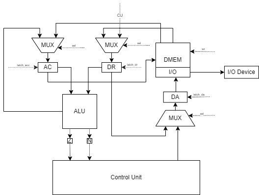

# Лабораторная работа №3. Отчёт

Кенжаев Рахимджон Ермахмадович, P3233

`alg | acc | harv | hw | tick | struct | stream | mem | cstr | prob1 |`

Базовый вариант (без усложнения)
## Синтаксис
``` ebnf
<program> ::= { <statement> }

<statement> ::= "if" <cond-expr> <statement> |
                "if" <cond-expr> <statement> "else" <statement> |
                "while" <cond-expr> <statement> |
                "{" { <statement> } "}" |
                <expr> ";" |
                <input> ";" |
                <output> ";" |
                <declaration> ";" |
                <variable_assignment> ";"


<declaration> ::= type <id> "=" <expr>

<variable_assignment> ::= <id> "=" <expr>

<cond-expr> ::= "(" <expr> ( "==" | "<" | ">" |"!=") <expr> ")"

<type> ::= "int" | "string"

<input> ::= "input" "( "<string>" + "." )" 

<output> ::= "print" ( <id> | <string> )

<expr> ::= <id> |
           <num> |
           <string> |
           <expr> "%" <expr> |
           <expr> "+" <expr> 

<id> ::= {<string>}-

<string> ::= {[a-zA-Z]}-

<num> ::= {"0" | "1" | ... | "9"}
```

### Особенности
- У переменных глобальная область видимости
- Статическая строгая типизация
- Поддерживаемые типы: `string`, `int`
  - `int` - фактически просто number. Принимает любое значение, которое может вместить в себя ячейка в массиве.
  - `string` - строковый тип. Выделяется фиксированный буфер, каждый символ хранится в своей ячейке, автоматически нуль-терминируется. 
- Поддерживаются математические операции: `+`,`%` (Имеется возможность реализации и других).
- Поддерживается сравнение символов (Возможна поддержка сравнения строк).
- Ввод должен оканчиваться `.` в случае если вводится строка.

## Организация памяти
### Память инструкций
Представляет собой массив объектов, каждый из которых может содержать: текущий адрес команды, opcode, адрес и режим адресации.

Виды адресации и Opcode представлены в файле [isa.py](./isa.py).

Размер машинного слова для инструкций не определен.


### Память данных
- Размер машинного слова не определён. В памяти данных хранятся данные - числа, строки, метки, временные переменные. 
- Каждая переменная имеет свою метку с указанием на адрес ячейки с данными
- Вывод данных из памяти осуществляется в data register или аккумулятор по адресу из data address.
- Ввод данных в память осуществляется через запись или чтение по определённым адресам памяти.
- За ввод и вывод отвечают по одной ячейке соответственно (одна за ввод и одна за вывод). Предполагается, что контроллер ВУ при запросе на чтение или запись автоматически передает или записывает следующий символ из(в) ввода(вывод).

### Модель данных
- Обращение к переменной всегда осуществляется через косвенную адресацию по её метке.
- Временные константы сохраняются на этапе трансляции и считаются типом int.

## Система команд
### Набор инструкций

| Opcode | ARG | Кол-во тактов | Описание                                                              |
|:-------|:----|:--------------|:----------------------------------------------------------------------|
| ST     | +   | 3-5           | сохранить значение в указанной ячейке из acc                          |
| LD     | +   | 3-5           | загрузить значение в acc                                              |
| CMP    | +   | 3-6           | установить флаги z и n по операции acc - dr                           |
| HLT    | -   | 0             | остановка                                                             |
| ADD    | +   | 3-6           | сложить значение из аккумулятора со значением, переданным в аргументе |
| MOD    | +   | 3             | посчитать остаток от деления acc на dr                                |
| INC    | -   | 2             | инкрементировать acc                                                  |
| JNE    | +   | 1             | переход если флаг z не установлен                                     |
| JE     | +   | 1             | переход если флаг z установлен                                        |
| JB     | +   | 1             | переход если флаг n установлен                                        |
| JMP    | +   | 1             | безусловный переход                                                   |

Реализовано 3 вида адресации операнда:
- IMMEDIATE - непосредственная. 
- DIRECT - прямая.
- INDIRECT - косвенная.
### Кодирование инструкций
- Машинный код сериализуется в список JSON.
- В коде также присутствуют метки для удобства чтения.
- В процессе компиляции метки заменяются значениями.

Пример инструкции:
```
      {
        "opcode": "ld",
        "operand": "CUR_ADR",
        "addr_mode": "indirect"
      }
```

## Транслятор
Реализован в [translator](./translator.py)

Этапы трансляции:
- Рукописный код разбивается на токены в классе `lexer`в соответствии регулярным выражениям. 
Типы токенов представлены в том же классе.
- В классе `parser` строится AST дерево на основе Node, представленных в `ast_nodes`.
- В классе `сode_generator` генерируется ассемблерный код согласно AST дереву. Код генерируется с метками, чтобы программист мог удобно его читать и отлаживать.
Все метки и данные выделяются в отдельные блоки. На этом этапе можно определить минимальный размер памяти для выполнения алгоритма.
- В классе `compiler` ассемблерный код сериализуется в машинный(метки заменяются числовыми значениями), секция данных сериализуется в массив.
- После этого во время инициализации памяти класс `memory_configurator` разделяет входную программу на память данных и инструкций. 
Далее инициализирует служебные адреса в памяти данных и исправляет ссылки на них в памяти инструкций.
### Пример
Пример AST дерева для программы:
```
  Program:
    Assign(var=username, var_type=STRING_TYPE)
      FunctionCall(input)
    Print:
      String("Hello, ")
    Print:
      Identifier(username)
```

## Модель процессора
Реализован в [machine](./machine.py)
### Схема
  

Control Unit:
- Моделирование на уровне тактов
- Instruction Decoder - декодировщик инструкций, отправляет в память данные в регистры `DA`/`DR` и необходимые сигналы в `Data Path`

Сигналы (обрабатываются за 1 такт, реализованы в виде методов класса):
- latch_acc - защелкнуть выбранное значение в `ACC`
- latch_dr - защелкнуть выбранное значение в `DR`
- latch_da - защелкнуть выбранное значение в `DA`
- signal_write_to_memory - записать значение из `ACC` в память по адресу из `DA` 
- signal_latch_program_counter- защелкнуть выбранное значение в `PC`

Флаги:
- `Z` (Zero) - отражает наличие нуля в результате операции в АЛУ
- `N` (Negative) - отражает наличие отрицательного значения в результате операции в АЛУ

Особенности работы модели:
- Команды проходят цикл выборки операнда - `operand_fetch` из-за разных видов адресаций.
- При каждой записи/загрузке происходит сравнения адреса со служебными адресами ввода/вывода для работы с ВУ.
- Цикл симуляции осуществляется в функции main.
- Шаг моделирования соответствует одной инструкции с выводом состояния в журнал.
- Для журнала состояний процессора используется стандартный модуль logging.
- Количество инструкций для моделирования лимитировано.
## Тестирование
В качестве тестов использовано 4 алгоритма согласно заданию:
- [hello](./golden/hello.yml)
- [username](./golden/username.yml)
- [cat](./golden/cat.yml)
- [prob1](./golden/prob1.yml)

Тестирование выполняется при помощи golden test-ов.


### 