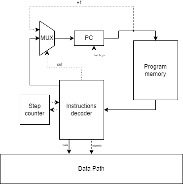

# Лабораторная работа №3. Отчёт

Кенжаев Рахимджон Ермахмадович, P3233 (P3333)

`alg | acc | harv | hw | tick | struct | stream | mem | cstr | prob1 |`

Базовый вариант (без усложнения)
## Синтаксис
``` ebnf
<program> ::= { <statement> }

<statement> ::= "if" <cond-expr> <statement> |
                "if" <cond-expr> <statement> "else" <statement> |
                "while" <cond-expr> <statement> |
                "{" { <statement> } "}" |
                <expr> ";" |
                <input> ";" |
                <output> ";" |
                <declaration> ";" |
                <variable_assignment> ";"


<declaration> ::= type <id> "=" <expr>

<variable_assignment> ::= <id> "=" <expr>

<cond-expr> ::= "(" <expr> ( "==" | "<" | ">" |"!=") <expr> ")"

<type> ::= "int" | "string"

<input> ::= "input" "( "<string>" + "." )" 

<output> ::= "print" ( <id> | <string> )

<expr> ::= <id> |
           <num> |
           <string> |
           <expr> "%" <expr> |
           <expr> "+" <expr> 

<id> ::= {<string>}-

<string> ::= {[a-zA-Z]}-

<num> ::= {"0" | "1" | ... | "9"}
```

### Особенности
- У переменных глобальная область видимости
- Статическая строгая типизация
- Поддерживаемые типы: `string`, `int`
  - `int` - фактически просто number. Принимает любое значение, которое может вместить в себя ячейка в массиве.
  - `string` - строковый тип. Выделяется фиксированный буфер, каждый символ хранится в своей ячейке, автоматически нуль-терминируется. 
- Поддерживаются математические операции: `+`,`%` (Имеется возможность реализации и других).
- Поддерживается сравнение символов (Возможна поддержка сравнения строк).
- Ввод должен оканчиваться `.` в случае если вводится строка.

## Организация памяти
### Память инструкций
Представляет собой массив объектов, каждый из которых может содержать: текущий адрес команды, opcode, адрес и режим адресации.

Виды адресации и Opcode представлены в файле [isa.py](./isa.py).

Размер машинного слова для инструкций не определен.


### Память данных
- Размер машинного слова не определён. В памяти данных хранятся данные - числа, строки, метки, временные переменные. 
- Каждая переменная имеет свою метку с указанием на адрес ячейки с данными
- Вывод данных из памяти осуществляется в data register или аккумулятор по адресу из data address.
- Ввод данных в память осуществляется через запись или чтение по определённым адресам памяти.
- За ввод и вывод отвечают по одной ячейке соответственно (одна за ввод и одна за вывод). Предполагается, что контроллер ВУ при запросе на чтение или запись автоматически передает или записывает следующий символ из(в) ввода(вывод).

### Модель данных
- Обращение к переменной всегда осуществляется через косвенную адресацию по её метке.
- Временные константы сохраняются на этапе трансляции и считаются типом int.

## Система команд
### Набор инструкций

| Opcode | ARG | Кол-во тактов | Описание                                                              |
|:-------|:----|:--------------|:----------------------------------------------------------------------|
| ST     | +   | 3-5           | сохранить значение в указанной ячейке из acc                          |
| LD     | +   | 3-5           | загрузить значение в acc                                              |
| CMP    | +   | 3-6           | установить флаги z и n по операции acc - dr                           |
| HLT    | -   | 0             | остановка                                                             |
| ADD    | +   | 3-6           | сложить значение из аккумулятора со значением, переданным в аргументе |
| MOD    | +   | 3             | посчитать остаток от деления acc на dr                                |
| INC    | -   | 2             | инкрементировать acc                                                  |
| JNE    | +   | 1             | переход если флаг z не установлен                                     |
| JE     | +   | 1             | переход если флаг z установлен                                        |
| JB     | +   | 1             | переход если флаг n установлен                                        |
| JMP    | +   | 1             | безусловный переход                                                   |

Реализовано 3 вида адресации операнда:
- IMMEDIATE - непосредственная. 
- DIRECT - прямая.
- INDIRECT - косвенная.
### Кодирование инструкций
- Машинный код сериализуется в список JSON.
- В коде также присутствуют метки для удобства чтения.
- В процессе компиляции метки заменяются значениями.

Пример инструкции:
```
      {
        "opcode": "ld",
        "operand": "CUR_ADR",
        "addr_mode": "indirect"
      }
```

## Транслятор
Реализован в [translator](./translator.py)

Интерфейс командной строки: `.\translator.py <input_file> <target_file>`

Этапы трансляции:
- Рукописный код разбивается на токены в классе `lexer`в соответствии регулярным выражениям. 
Типы токенов представлены в том же классе.
- В классе `parser` строится AST дерево на основе Node, представленных в `ast_nodes`.
- В классе `сode_generator` генерируется ассемблерный код согласно AST дереву. Код генерируется с метками, чтобы программист мог удобно его читать и отлаживать.
Все метки и данные выделяются в отдельные блоки. На этом этапе можно определить минимальный размер памяти для выполнения алгоритма.
- В классе `compiler` ассемблерный код сериализуется в машинный(метки заменяются числовыми значениями), секция данных сериализуется в массив.
- После этого во время инициализации памяти класс `memory_configurator` разделяет входную программу на память данных и инструкций. 
Далее инициализирует служебные адреса в памяти данных и исправляет ссылки на них в памяти инструкций.
### Пример
Пример AST дерева для программы:
```
  Program:
    Assign(var=username, var_type=STRING_TYPE)
      FunctionCall(input)
    Print:
      String("Hello, ")
    Print:
      Identifier(username)
```

## Модель процессора
Реализован в [machine](./machine.py)

Интерфейс командной строки: `.\machine.py <input_file> <target_file>`

### Схема
  

Control Unit:
- Моделирование на уровне тактов
- Instruction Decoder - декодировщик инструкций, отправляет в память данные в регистры `DA`/`DR` и необходимые сигналы в `Data Path`

Сигналы (обрабатываются за 1 такт, реализованы в виде методов класса):
- latch_acc - защелкнуть выбранное значение в `ACC`
- latch_dr - защелкнуть выбранное значение в `DR`
- latch_da - защелкнуть выбранное значение в `DA`
- signal_write_to_memory - записать значение из `ACC` в память по адресу из `DA` 
- signal_latch_program_counter- защелкнуть выбранное значение в `PC`

Флаги:
- `Z` (Zero) - отражает наличие нуля в результате операции в АЛУ
- `N` (Negative) - отражает наличие отрицательного значения в результате операции в АЛУ

Особенности работы модели:
- Команды проходят цикл выборки операнда - `operand_fetch` из-за разных видов адресаций.
- При каждой записи/загрузке происходит сравнения адреса со служебными адресами ввода/вывода для работы с ВУ.
- Цикл симуляции осуществляется в функции main.
- Шаг моделирования соответствует одной инструкции с выводом состояния в журнал.
- Для журнала состояний процессора используется стандартный модуль logging.
- Количество инструкций для моделирования лимитировано.
## Тестирование
В качестве тестов использовано 4 алгоритма согласно заданию:
- [hello](./golden/hello.yml)
- [username](./golden/username.yml)
- [cat](./golden/cat.yml)
- [prob1](./golden/prob1.yml)

Тестирование выполняется при помощи golden test-ов.

Запустить тесты: `poetry run pytest . -v`

Обновить конфигурацию golden tests: `poetry run pytest . -v --update-goldens`
### 
CI при помощи Github Action:

``` yaml
name: Python CI

on:
  push:
    branches:
      - main
  pull_request:
    branches:
      - main

permissions:
  contents: read

jobs:
  test:
    runs-on: ubuntu-latest

    steps:
      - name: Checkout code
        uses: actions/checkout@v4

      - name: Set up Python
        uses: actions/setup-python@v4
        with:
          python-version: 3.10.7

      - name: Install dependencies
        run: |
          python -m pip install --upgrade pip
          pip install poetry
          poetry install

      - name: Run tests and collect coverage
        run: |
          poetry run coverage run -m pytest .
          poetry run coverage report -m
        env:
          CI: true
          

  lint:
    runs-on: ubuntu-latest

    steps:
      - name: Checkout code
        uses: actions/checkout@v4

      - name: Set up Python
        uses: actions/setup-python@v4
        with:
          python-version: 3.11

      - name: Install dependencies
        run: |
          python -m pip install --upgrade pip
          pip install poetry
          poetry install

      - name: Check code formatting with Ruff
        run: poetry run ruff format .

      - name: Run Ruff linters
        run: poetry run ruff .
```

где:

- `poetry` -- управления зависимостями для языка программирования Python.
- `coverage` -- формирование отчёта об уровне покрытия исходного кода.
- `pytest` -- утилита для запуска тестов.
- `ruff` -- утилита для форматирования и проверки стиля кодирования.

Пример использования и журнал работы процессора на примере `hello`:

``` 
(.venv) PS C:\...\PycharmProjects\CSA_3> ./translator.py hello.txt output_instr.json
DEBUG:root:Source code read from hello.txt
DEBUG:root:Starting translation process.
DEBUG:root:Lexer finished.
DEBUG:root:Parser finished. AST generated.
DEBUG:root:AST saved to output_code.json.
DEBUG:root:Code generation finished.
DEBUG:root:Unified JSON saved to output_compiler.json.
DEBUG:root:Memory configuration saved to output_compiler_memory.json and output_instr.json.
DEBUG:root:Translation process completed.
DEBUG:root:Translation completed and output saved to output_instr.json
(.venv) PS C:\Users\rahim\PycharmProjects\CSA_3> .\machine.py output_instr.json test.txt
DEBUG - Machine code loaded from output_instr.json
DEBUG - Input data loaded from ['hello']
INFO - Загрузка данных из файла: output_compiler_memory.json
INFO - Начинаем инициализацию памяти...
INFO - Memory[125] initialized with CUR_ADR (125)
INFO - Memory[126] initialized with IN_ADR (126)
INFO - Memory[127] initialized with OUT_ADR (127)
INFO - Инициализация памяти завершена.
INFO - Initialized memory: [1, 'H', 'e', 'l', 'l', 'o', ' ', 'w', 'o', 'r', 'l', 'd', '!', '\x00', 0, 0, 0, 0, 0, 0, 0, 0, 0, 0, 0, 0, 0, 0, 0, 0, 0, 0, 0, 0, 0, 0, 0, 0, 0, 0, 0, 0, 0, 0, 0, 0, 0, 0, 0, 0, 0, 0, 0, 0, 0, 0, 0, 0, 0, 0, 0, 0, 0, 0, 0, 0, 0, 0, 0, 0, 0, 0, 0, 0, 0, 0, 0, 0, 0, 0, 0, 0, 0, 0, 0, 0, 0, 0, 0, 0, 0, 0, 0, 0, 0, 0, 0, 0, 0, 0, 0, 0, 0, 0, 0, 0, 0, 0, 0, 0, 0, 0, 0, 0, 0, 0, 0, 0, 0, 0, 0, 0, 0, 0, 0, 125, 126, 127]
DEBUG - Control Unit initialized.
DEBUG - Starting program execution.
DEBUG - Decoding instruction at PC: 0 - Opcode: ld
DEBUG - Executing control flow instruction: ld at PC: 0
DEBUG - Executing LD instruction. Address mode: direct
DEBUG - {{TICK: 1, PC: 0, ADDR: 0, ACC: 0, DR: 0, DA: 0}}
DEBUG - {{TICK: 2, PC: 0, ADDR: 0, ACC: 1, DR: 0, DA: 0}}
DEBUG - {{TICK: 3, PC: 1, ADDR: 0, ACC: 1, DR: 0, DA: 0}}
DEBUG - Control Unit state: {TICK: 3, PC: 1, ADDR: 0, ACC: 1, DR: 0, DA: 0}
DEBUG - Decoding instruction at PC: 1 - Opcode: st
DEBUG - Executing control flow instruction: st at PC: 1
DEBUG - Executing ST instruction. Address mode: direct
DEBUG - {{TICK: 4, PC: 1, ADDR: 125, ACC: 1, DR: 0, DA: 125}}
DEBUG - Stored accumulator data into memory at address 125.
DEBUG - {{TICK: 5, PC: 1, ADDR: 125, ACC: 1, DR: 0, DA: 125}}
DEBUG - {{TICK: 6, PC: 2, ADDR: 125, ACC: 1, DR: 0, DA: 125}}
DEBUG - Control Unit state: {TICK: 6, PC: 2, ADDR: 125, ACC: 1, DR: 0, DA: 125}
DEBUG - Decoding instruction at PC: 2 - Opcode: ld
DEBUG - Executing control flow instruction: ld at PC: 2
DEBUG - Executing LD instruction. Address mode: indirect
DEBUG - {{TICK: 7, PC: 2, ADDR: 125, ACC: 1, DR: 0, DA: 125}}
DEBUG - {{TICK: 8, PC: 2, ADDR: 125, ACC: 1, DR: 1, DA: 125}}
DEBUG - {{TICK: 9, PC: 2, ADDR: 1, ACC: 1, DR: 1, DA: 1}}
DEBUG - {{TICK: 10, PC: 2, ADDR: 1, ACC: H, DR: 1, DA: 1}}
DEBUG - {{TICK: 11, PC: 3, ADDR: 1, ACC: H, DR: 1, DA: 1}}
DEBUG - Control Unit state: {TICK: 11, PC: 3, ADDR: 1, ACC: H, DR: 1, DA: 1}
DEBUG - Decoding instruction at PC: 3 - Opcode: cmp
DEBUG - Executing control flow instruction: cmp at PC: 3
DEBUG - {{TICK: 12, PC: 3, ADDR: 1, ACC: H, DR: , DA: 1}}
DEBUG - {{TICK: 13, PC: 3, ADDR: 1, ACC: H, DR: , DA: 1}}
DEBUG - {{TICK: 14, PC: 4, ADDR: 1, ACC: H, DR: , DA: 1}}
DEBUG - Control Unit state: {TICK: 14, PC: 4, ADDR: 1, ACC: H, DR: , DA: 1}
DEBUG - Decoding instruction at PC: 4 - Opcode: je
DEBUG - Executing control flow instruction: je at PC: 4
DEBUG - JE condition not met. Incrementing PC.
DEBUG - {{TICK: 15, PC: 5, ADDR: 1, ACC: H, DR: , DA: 1}}
DEBUG - Control Unit state: {TICK: 15, PC: 5, ADDR: 1, ACC: H, DR: , DA: 1}
DEBUG - Decoding instruction at PC: 5 - Opcode: st
DEBUG - Executing control flow instruction: st at PC: 5
DEBUG - Executing ST instruction. Address mode: direct
DEBUG - {{TICK: 16, PC: 5, ADDR: 127, ACC: H, DR: , DA: 127}}
DEBUG - Stored accumulator data into memory at address 127.
INFO - New output detected at address 127: H
INFO - OUTPUT: ['H']
DEBUG - {{TICK: 17, PC: 5, ADDR: 127, ACC: H, DR: , DA: 127}}
DEBUG - {{TICK: 18, PC: 6, ADDR: 127, ACC: H, DR: , DA: 127}}
DEBUG - Control Unit state: {TICK: 18, PC: 6, ADDR: 127, ACC: H, DR: , DA: 127}
DEBUG - Decoding instruction at PC: 6 - Opcode: ld
DEBUG - Executing control flow instruction: ld at PC: 6
DEBUG - Executing LD instruction. Address mode: direct
DEBUG - {{TICK: 19, PC: 6, ADDR: 125, ACC: H, DR: , DA: 125}}
DEBUG - {{TICK: 20, PC: 6, ADDR: 125, ACC: 1, DR: , DA: 125}}
DEBUG - {{TICK: 21, PC: 7, ADDR: 125, ACC: 1, DR: , DA: 125}}
DEBUG - Control Unit state: {TICK: 21, PC: 7, ADDR: 125, ACC: 1, DR: , DA: 125}
DEBUG - Decoding instruction at PC: 7 - Opcode: inc
DEBUG - Executing control flow instruction: inc at PC: 7
DEBUG - {{TICK: 22, PC: 7, ADDR: 125, ACC: 1, DR: , DA: 125}}
DEBUG - {{TICK: 23, PC: 7, ADDR: 125, ACC: 2, DR: , DA: 125}}
DEBUG - {{TICK: 24, PC: 8, ADDR: 125, ACC: 2, DR: , DA: 125}}
DEBUG - Control Unit state: {TICK: 24, PC: 8, ADDR: 125, ACC: 2, DR: , DA: 125}
DEBUG - Decoding instruction at PC: 8 - Opcode: st
...
DEBUG - Executing control flow instruction: je at PC: 4
DEBUG - JE condition met. Jumping to address: 10
DEBUG - {{TICK: 279, PC: 10, ADDR: 13, ACC: , DR: , DA: 13}}
DEBUG - Control Unit state: {TICK: 279, PC: 10, ADDR: 13, ACC: , DR: , DA: 13}
DEBUG - Decoding instruction at PC: 10 - Opcode: hlt
DEBUG - Executing control flow instruction: hlt at PC: 10
DEBUG - HLT instruction encountered. Halting execution.
DEBUG - Program halted.
DEBUG - Program finished. Output buffer contents: Hello world!
Output: Hello world!
DEBUG - Machine output: Hello world!
Hello world!

```

Пример проверки исходного кода:

``` 
(.venv) PS C:\...\PycharmProjects\CSA_3> poetry run pytest . -v
=============================================================================================================== test session starts ===============================================================================================================
platform win32 -- Python 3.10.4, pytest-7.4.4, pluggy-1.5.0 -- C:\...\PycharmProjects\CSA_3\.venv\Scripts\python.exe
rootdir: C:\...\PycharmProjects\CSA_3
plugins: golden-0.2.2
collected 12 items                                                                                                                                                                                                                                  

golden_test.py::test_ast[golden/cat.yml] PASSED                                                                                                                                                                                              [  8%] 
golden_test.py::test_ast[golden/prob1.yml] PASSED                                                                                                                                                                                            [ 25%] 
golden_test.py::test_ast[golden/username.yml] PASSED                                                                                                                                                                                         [ 33%] 
golden_test.py::test_generator[golden/cat.yml] PASSED                                                                                                                                                                                        [ 41%] 
golden_test.py::test_generator[golden/hello.yml] PASSED                                                                                                                                                                                      [ 50%] 
golden_test.py::test_generator[golden/prob1.yml] PASSED                                                                                                                                                                                      [ 58%] 
golden_test.py::test_generator[golden/username.yml] PASSED                                                                                                                                                                                   [ 66%] 
golden_test.py::test_translator_and_machine[golden/cat.yml] PASSED                                                                                                                                                                           [ 75%] 
golden_test.py::test_translator_and_machine[golden/hello.yml] PASSED                                                                                                                                                                         [ 83%] 
golden_test.py::test_translator_and_machine[golden/prob1.yml] PASSED                                                                                                                                                                         [ 91%] 
golden_test.py::test_translator_and_machine[golden/username.yml] PASSED                                                                                                                                                                      [100%] 

=============================================================================================================== 12 passed in 20.85s =============================================================================================================== 
(.venv) PS C:\...\PycharmProjects\CSA_3> poetry run ruff check .
All checks passed!
(.venv) PS C:\...\PycharmProjects\CSA_3> poetry run ruff format .
12 files left unchanged

```

```text
| ФИО                               | алг         | LoC | code байт | code инстр. | инстр.  | такт. | вариант |
| Кенжаев Рахимджон Ермахмадович    | hello       | 1   | -         | 9           | 102     | 279   | alg | acc | harv | hw | tick | struct | stream | mem | cstr | prob1  |     |
| Кенжаев Рахимджон Ермахмадович    | hello_user  | 3   | -         | 27          | 232     | 649   | alg | acc | harv | hw | tick | struct | stream | port | pstr | prob1 |     |
| Кенжаев Рахимджон Ермахмадович    | cat         | 4   | -         | 32          | 492     | 1387  | alg | acc | harv | hw | tick | struct | stream | port | pstr | prob1 |     |
| Кенжаев Рахимджон Ермахмадович    | prob1       | 14  | -         | 31          | 10000+  | 68677 | alg | acc | harv | hw | tick | struct | stream | port | pstr | prob1 |     |
```
